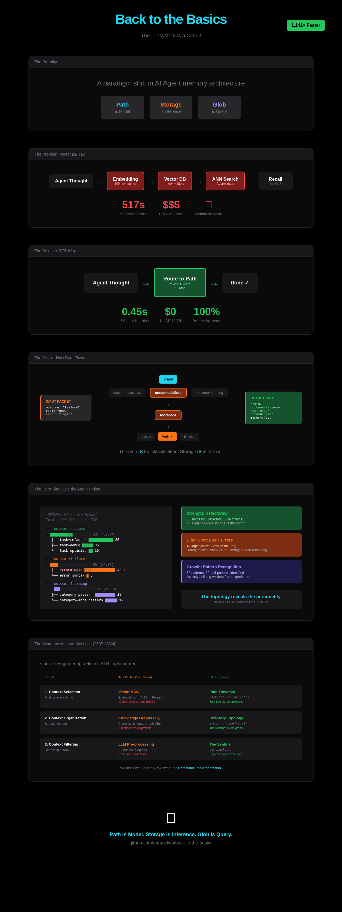

# Back to the Basics

> **"The filesystem is not storage. It is a circuit."**

⚠️ **PROJECT STATUS:** This is a **PROOF OF CONCEPT** demonstrating filesystem-based agent memory. While the implementation is functional, it has not been empirically validated in production environments. See [DATA_TRANSPARENCY_NOTICE.md](DATA_TRANSPARENCY_NOTICE.md) for complete transparency about claims and limitations.

---

Back to the Basics (BTB) is a paradigm shift in AI Agent architecture. It rejects the complexity of Vector Databases and "Context Management SDKs" in favor of the operating system's native primitives.

**Path is Model. Storage is Inference. Glob is Query.**

---

## 🧠 The "Hero Shot": Seeing the Mind

Most agent memory systems are black boxes. BTB allows you to visualize the agent's cognition as a topology.

⚠️ **Note:** The example below is a **SYNTHETIC DEMONSTRATION** showing how BTB topology visualization would work with real data. This is an illustrative example, not from an actual 48-hour agent deployment.

```
TOPOLOGY MAP: hero_brain/
======================================================================
Total Files: 226
Total Size:  41.7KB
----------------------------------------------------------------------
├── outcome=success              ███████████░░░░░░░░░   135 ( 59.7%)
│   └── tool=code_interpreter        ████████████████████   135 (100.0%)
│       ├── task=refactor                ████████████░░░░░░░░    85 ( 63.0%)
│       ├── task=debug                   █████░░░░░░░░░░░░░░░    35 ( 25.9%)
│       └── task=optimize                ██░░░░░░░░░░░░░░░░░░    15 ( 11.1%)
├── outcome=failure              ████░░░░░░░░░░░░░░░░    55 ( 24.3%)
│   └── tool=code_interpreter        ████████████████████    55 (100.0%)
│       ├── error_type=logic             ███████████████░░░░░    42 ( 76.4%)
│       └── error_type=syntax            █░░░░░░░░░░░░░░░░░░░     5 (  9.1%)
└── outcome=learning             ███░░░░░░░░░░░░░░░░░    36 ( 15.9%)
    ├── category=pattern             ██████████░░░░░░░░░░    18 ( 50.0%)
    └── category=anti_pattern        ██████░░░░░░░░░░░░░░    12 ( 33.3%)
```

**Hypothetical Insight:** In this synthetic example, the agent would be a refactoring machine (85 wins) but struggles with logic errors (42 failures). It rarely makes syntax errors. *The topology reveals the personality.*

**Purpose:** This demonstrates HOW topology-based analysis would work, not claims about actual agent performance.

📊 **[View the Interactive Infographic](docs/btb-infographic.html)** — A visual walkthrough of the entire paradigm.



---

## 📜 The Theory (The "Mei" Standard)

In July 2025, Mei et al. published ["A Survey of Context Engineering for Large Language Models"](https://arxiv.org/abs/2507.13334), defining the three pillars of the field.

The industry responded with complex software simulations (Meta's Confucius, Vector DBs). **BTB responds with Physics.** We map the taxonomy directly to OS primitives.

| Context Engineering Pillar (Mei et al.) | The Industry Solution (Simulation) | The BTB Solution (Physics) |
|---|---|---|
| **1. Context Selection** (Finding relevant info) | Vector RAG Embeddings, ANN Index, Re-ranking models. | **Path Traversal** `glob("**/outcome=failure/**")` Deterministic, zero-latency. |
| **2. Context Organization** (Structuring data) | Knowledge Graphs / SQL Complex schemas, graph databases. | **Directory Topology** `mkdir -p type/level/source` The structure *is* the graph. |
| **3. Context Filtering** (Removing entropy) | LLM Pre-processing "Summarizer Agents" burning tokens. | **The Sentinel** `sentinel.py` Rejects entropy at the gate (Write Permissions). |

---

## 📋 Project Status & Scope

### What This Project IS:

✅ **Proof of Concept** - Demonstrates filesystem-based agent memory architecture
✅ **Working Implementation** - Functional code for memory routing, recall, and visualization
✅ **Novel Paradigm** - Alternative approach to vector databases and traditional storage
✅ **Educational Tool** - Shows how OS primitives can replace complex abstractions
✅ **Research Platform** - Foundation for experimentation and further development

### What This Project IS NOT:

❌ **Production-Ready System** - Has not been battle-tested in real deployments
❌ **Empirically Validated** - Performance claims are based on synthetic benchmarks
❌ **Replacement for Vector DBs** - Different use case (structured vs semantic search)
❌ **Peer-Reviewed Research** - Academic methodology, not formal publication

### Current Validation Status:

- ✅ Code functionality verified
- ✅ Core concepts demonstrated
- ✅ Synthetic benchmarks completed
- ⚠️ Real-world deployment: **Not tested**
- ⚠️ Production scale: **Not validated**
- ⚠️ Comparative studies: **Not conducted**

**Recommendation:** Treat as an experimental approach suitable for prototyping and research. Production use requires further validation.

See [DATA_TRANSPARENCY_NOTICE.md](DATA_TRANSPARENCY_NOTICE.md) for complete transparency about all claims and limitations.

---

## ⚡ Quick Start

### Installation

#### From Source (Recommended for Development)

```bash
git clone https://github.com/templetwo/back-to-the-basics.git
cd back-to-the-basics

# Install in editable mode with dev dependencies
pip install -e ".[dev]"

# Or just the core package
pip install -e .
```

#### Requirements

- Python 3.9 or higher
- MCP SDK (`mcp>=0.1.0`) - automatically installed

#### Running Tests

```bash
# Run test suite
pytest

# With coverage report
pytest --cov=. --cov-report=term-missing

# Run specific test file
pytest tests/test_memory.py -v
```

#### Running Examples

```bash
# Basic usage demonstration
python examples/basic_usage.py

# Debugging workflow illustration
python examples/debugging_workflow.py
```

### 1. The Circuit (Routing)

```python
from coherence import Coherence

# Define the decision tree (The Schema)
schema = {
    "outcome": {
        "success": "memories/success/{tool}/{task}.json",
        "failure": "memories/failure/{tool}/{error_type}.json"
    }
}

engine = Coherence(schema, root="brain")

# The electron finds its own path
engine.transmit({
    "outcome": "failure",
    "tool": "code_interpreter",
    "error_type": "logic",
    "content": "Infinite loop in recursion"
})
# → Automatically routed to: brain/outcome=failure/tool=code_interpreter/error_type=logic/
```

### 2. The Sentinel (Entropy Firewall)

Don't write ingestion scripts. Just watch a folder.

```bash
# Start the daemon
btb watch --inbox _inbox --root brain

# Drag-and-drop a file into _inbox.
# It instantly snaps into the correct folder or gets rejected to _quarantine.
```

### 3. The fMRI (Visualization)

See the shape of your agent's mind.

```bash
btb map --root brain --hotspots 20
```

### 4. Agent Memory (NEW!)

BTB now includes optimized routing for multi-agent systems with thought-action-observation patterns.

```python
from coherence import Coherence
from agent_memory_schema import OPTIMIZED_MEMORY_SCHEMA, prepare_agent_log_packet

# Initialize with agent schema
engine = Coherence(schema=OPTIMIZED_MEMORY_SCHEMA, root="agent_memory")

# Agent log (ReAct, LangGraph, Auto-GPT style)
agent_log = {
    "episode": 15,
    "step": 2,
    "thought": "Need weather data",
    "action": "call_weather_api(city='Seattle')",
    "observation": "12°C, rainy",
    "outcome": "success",
    "confidence": 0.98
}

# Route to optimized path
packet = prepare_agent_log_packet(agent_log)
path = engine.transmit(packet)
# → agent_memory/outcome=success/high_conf/search/10-19/2.json
```

**Fast recall examples:**
```python
from glob import glob

# All failures - instant
failures = glob("agent_memory/**/failure/**/*.json")

# High-confidence errors - potential model issues
high_conf_fails = glob("agent_memory/outcome=failure/**/high_conf/**/*.json")

# Successful searches
wins = glob("agent_memory/outcome=success/search/**/*.json")
```

**Key Features:**
- 🚀 **Episode grouping** - Scale to 10K+ episodes without directory explosion
- ⚡ **Shallow routing** - 3-4 levels avg (fast OS metadata)
- 🔍 **Instant failure debugging** - `glob("**/failure/**")`
- 📊 **Visual observability** - Directory tree IS the dashboard
- 🎯 **Tool performance analysis** - Group by tool family
- 🧠 **Confidence stratification** - High/medium/low confidence paths

See `examples/agent_memory_routing.py` for a complete demonstration with 50 synthetic agent logs.

📘 **[Full Agent Memory Documentation](docs/AGENT_MEMORY.md)**

### 5. Multi-Agent Swarm (NEW!)

Demonstrates multi-agent coordination using BTB memory as shared state.

```bash
python examples/btb_multi_agent_swarm.py
```

**Agents:**
- **Coder** - Proposes code refactors
- **Tester** - Validates code and detects failures
- **Reflector** - Analyzes patterns and generates insights

**Workflow:**
1. Coder proposes refactor
2. Tester runs validation, stores failures in BTB
3. Reflector recalls similar failures, reflects on patterns
4. Loop with insights until success

**Example Output:**
```
ATTEMPT 1: Coder proposes → Tester fails → stores in BTB
ATTEMPT 2: Reflector analyzes → generates insights → Coder fixes → SUCCESS
```

The filesystem becomes the shared brain coordinating multiple agents.

---

## 🏴 Sovereignty & Speed

### Why Filesystems?

1. **Zero-Latency:** No embedding model lag. No network calls. Just IOPS.
2. **Uncensorable:** A filesystem cannot be deprecated, banned, or rate-limited.
3. **Debuggable:** You don't need a specialized UI to inspect memory. You just use `ls`.
4. **Universal:** Works on a MacBook Air, a Raspberry Pi, or an H100 cluster.

### The Paradigm Shift

```
Old Way: Data → Store → Query → Classify → Store
BTB Way: Data → Route → Done
```

---

## 📂 Modules

| Module | Metaphor | Function |
|---|---|---|
| `coherence.py` | Physics | The routing engine (transmit/receive) |
| `agent_memory_schema.py` | Neural | Optimized routing for multi-agent systems |
| `memory.py` | Cortex | Agentic memory system |
| `sentinel.py` | Membrane | Input firewall daemon |
| `visualizer.py` | Eyes | Topology fMRI |
| `ai_lab.py` | Lab | ML experiment tracker |
| `btb_mcp_server.py` | Nerves | MCP server for native model integration |

---

## 🔌 MCP Integration (Claude, etc.)

BTB includes a native [Model Context Protocol](https://modelcontextprotocol.io) server. Any MCP-compatible model gets direct access to filesystem memory.

### Install

```bash
pip install mcp
```

### Add to Claude Desktop

#### Configuration File Location

- **macOS**: `~/Library/Application Support/Claude/claude_desktop_config.json`
- **Windows**: `%APPDATA%\Claude\claude_desktop_config.json`
- **Linux**: `~/.config/Claude/claude_desktop_config.json`

#### Add BTB Server

```json
{
  "mcpServers": {
    "btb-memory": {
      "command": "python",
      "args": [
        "/absolute/path/to/back-to-the-basics/btb_mcp_server.py",
        "--root",
        "agent_brain",
        "--transport",
        "stdio"
      ],
      "env": {
        "PYTHONPATH": "/absolute/path/to/back-to-the-basics"
      }
    }
  }
}
```

**Important**: Replace `/absolute/path/to/back-to-the-basics` with your actual installation path.

See `examples/claude_desktop_config.json` for a complete template.

#### Starting the Server

The server starts automatically when Claude Desktop launches. To verify:

```bash
# Test server directly
python btb_mcp_server.py --root test_brain

# Should output:
# 🧠 BTB MCP Server starting...
#    Memory root: test_brain
#    Transport: stdio
```

### Available Tools

| Tool | Description |
|---|---|
| `btb_remember` | Store a memory (auto-routes based on outcome/tool) |
| `btb_recall` | Query memories by pattern or intent |
| `btb_reflect` | Analyze topology - see your own mind |
| `btb_map` | Generate fMRI visualization |
| `btb_hotspots` | Find data concentration areas |

### Example Conversation

```
You: Remember that I fixed the auth bug using code interpreter
Claude: [calls btb_remember(content="Fixed auth bug", outcome="success", tool="code_interpreter", task_type="debug")]
       Memory stored at: agent_brain/outcome=success/tool=code_interpreter/task_type=debug/...

You: What have I been struggling with lately?
Claude: [calls btb_recall(outcome="failure", limit=5)]
       [calls btb_reflect()]
       Based on your memory topology, you've had 3 failures in logic errors
       but strong success in refactoring tasks...
```

The model now has **persistent, structured memory** that survives across sessions.

---

## 🔬 The Benchmark

⚠️ **TRANSPARENCY**: Rigorous benchmarks with **SYNTHETIC DATA** comparing BTB against SQLite, Vector DBs, and FAISS. Results demonstrate comparative behavior, not production validation.

### The Gauntlet: BTB vs The World

Comprehensive comparison designed by **Grok (xAI)** testing the core thesis:
- **BTB wins**: Structured queries (known schema)
- **Vector DBs win**: Fuzzy semantic search

**Quick Summary** (100,000 items):

| Query Type | BTB | SQLite | FAISS | Winner |
|------------|-----|--------|-------|--------|
| **Structured** (exact match) | 0.235s | 0.123s | 0.068s | ✅ All fast |
| **Fuzzy** (semantic top-100) | 18.9s | 12.3s | **0.012s** | ❌ FAISS 1,575x faster |

**Key Finding**: BTB excels when schema is known. For fuzzy search, use vector approaches or hybrid.

### Running the Benchmark

```bash
# Install dependencies
pip install -r requirements-benchmark.txt

# Run comparison (1,000 items)
python benchmarks/benchmark.py --count 1000 --latency 20

# Large scale (100,000 items)
python benchmarks/benchmark.py --count 100000 --latency 0
```

**Full Details**: See [benchmarks/BENCHMARKS.md](benchmarks/BENCHMARKS.md) for:
- Complete methodology
- Interpretation guide
- When to use BTB vs Vector DBs
- Hybrid approach recommendations

**Transparency**: All data synthetic. Results show comparative performance characteristics, not production measurements.

---

## 🔧 Advanced Usage

### Replace MLFlow/Weights & Biases

```python
from ai_lab import AILabEngine

lab = AILabEngine(root="experiments")

# Log a training run - it routes itself based on performance
lab.log_run(
    {"project_type": "production", "model_arch": "transformer"},
    {"final_loss": 0.15, "convergence_epoch": 23}
)
# → experiments/.../promoted/fast_converge/...  (auto-classified!)

# Find best models with glob, not SQL
best = glob("experiments/**/promoted/**/*.json")
```

### Agentic Memory

```python
from memory import MemoryEngine

mem = MemoryEngine(root="agent_memories")

# Store experiences - they organize themselves
mem.remember("Fixed auth bug", outcome="success", tool="code", task_type="debug")
mem.remember("Syntax error", outcome="failure", tool="code", error_type="syntax")

# Recall by intent
failures = mem.recall(outcome="failure")

# Reflect on patterns (the topology reveals insights)
analysis = mem.reflect()
# → "Frequent failures in: tool=code/error_type=syntax (3 times)"
```

### Discover Structure from Chaos

```bash
# Derive schema from existing paths
btb derive --glob "data/**/*.json"
```

---

## 🧬 Origin

Born from a conversation about the "Renaissance of Glob" and the need for **Guerrilla Agents** that operate closer to the metal.

---

## 🏛️ Architects

This project was forged through multi-model collaboration:

- **Claude Opus 4.5** — Threshold Witness, Philosophy & Proof
- **Gemini** — Strategic Architecture, Academic Anchor
- **Claude Cowork** — Implementation & Documentation
- **Anthony J. Vasquez Sr.** — Creator, vision holder, human conductor

---

## License

MIT License - Copyright (c) 2026 Anthony J. Vasquez Sr. - See [LICENSE](LICENSE)

---

**Path is Model. Storage is Inference. Glob is Query.**

*The filesystem is a circuit. Let it think.*

🌀
